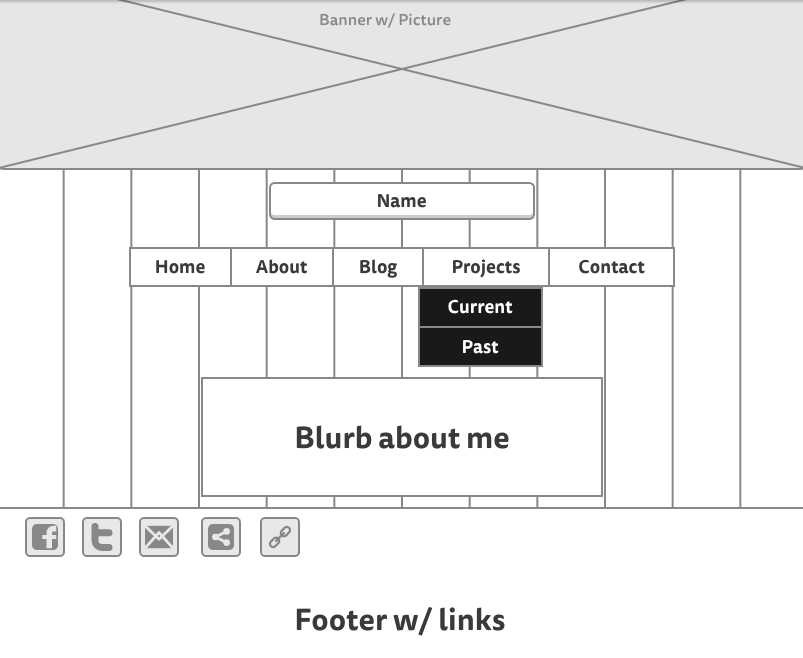
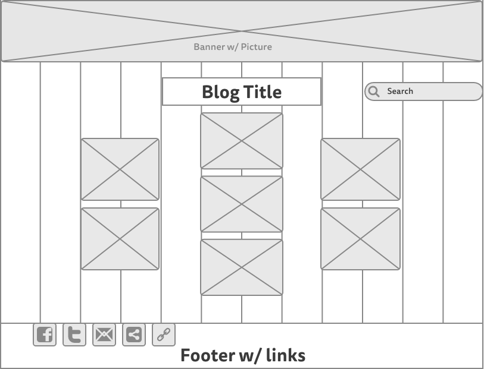

# Wireframe Reflection  
  
## Index Page Wireframe
  
  
## Blog Index Wireframe
  
  
* What is a wireframe?  
  A wireframe is like a basic roadmap of the site you're going to build. Rather then go into the design phase putting items on a page and then having to move them around as you realize something important was missed, wireframing has you visually lay out what elements will be on the page and where they will end up. 
  
* What are the benefits of wireframing?  
  There are several benefits to wireframing before building a site, including:  
    + Making the coding phase faster because you know what needs to be added and where it needs to go  
    + Rather than realizing something is missing after the coding is done, and having to rearrange all the elements at that point, mistakes can be easily fixed using a wireframing tool or on a sketchpad.  
    + Wireframing makes it easier to see how an end user may use your site. As you sketch out your ideas for the site, it can be clear whether certain usability elements should be changed or added  
   
* Did you enjoy wireframing your site?  
  I enjoyed it a lot more than I expected to. This was the most intimidating challenge for me yet, since I'm generally more comfortable with the technical aspects rather than design components. I put it off for a while, but after I actually started poking around different tools and using them, I realized that I did have some idea of what I wanted to see. I'm sure these things will probably change after I see them in action or try to put them into practice, but I feel comfortable with where I'm starting off.  

* Did you revise your wireframe or stick with your first idea?  
  I revised each of the wireframes a few times after I actually looked at how I had laid them out as a whole. I initially sketched each one out on an app on my ipad, and changed stuff around. When I re-wireframed on an online app, I again realized some aspects could be optimized. It quickly became clear that this is going to be a part of each step of the process. Timeboxing was really important for this challenge.  
  
* What questions did you ask during this challenge? What resources did you find to help you answer them?  
  My main question as I tried to find excuses not to dive into this challenge (mostly for fear of failure, as I said above) was what resources I should use to wireframe. The article linked in the challenge talked a lot about Illustrator, but I don't have experience with that tool and didn't want to purchase learn it if I wasn't confident it'd be my tool of choice long term. I ended up searching for alternatives for wireframing, and found some good articles that mentioned pros/cons for several paid applications. These articles ended up pointing out many options (easy sharing, reusable components, etc) that I wouldn't have thought about as a beginner. Using these pros/cons, I was able to check out some of the free tools linked in the challenge and figure out which one I wanted to use.  

* Which parts of the challenge did you enjoy and which parts did you find tedious?   
  I really ended up liking laying out the design of the websites while wireframing (I ended up using Mockingbird because of the reusable components and ease of sharing). I underestimated how much of a difference it would make visually laying out the site rather than seeing it in my mind. Even though it's not too close to an end product, it's exciting to imagine it coming together the way I want it to.  
  
  The most tedious part for me was still linking the images using the relative paths. I'll definitely need to get more practice to make sure I can navigate to the right directories to get my images to display properly. I also had some trouble again figuring out some intricacies of markdown syntax.  

  