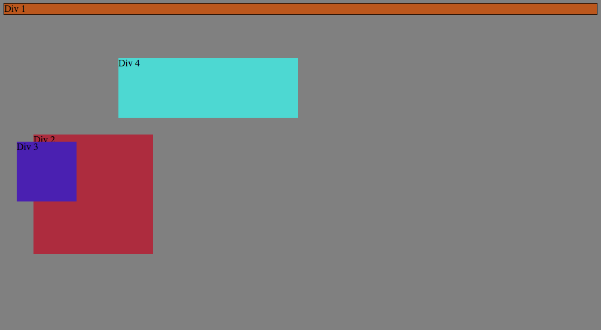
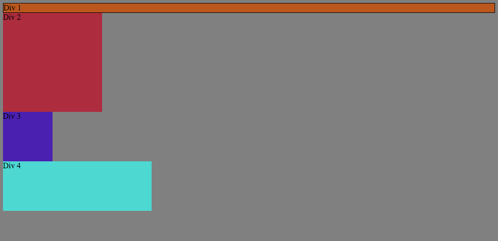
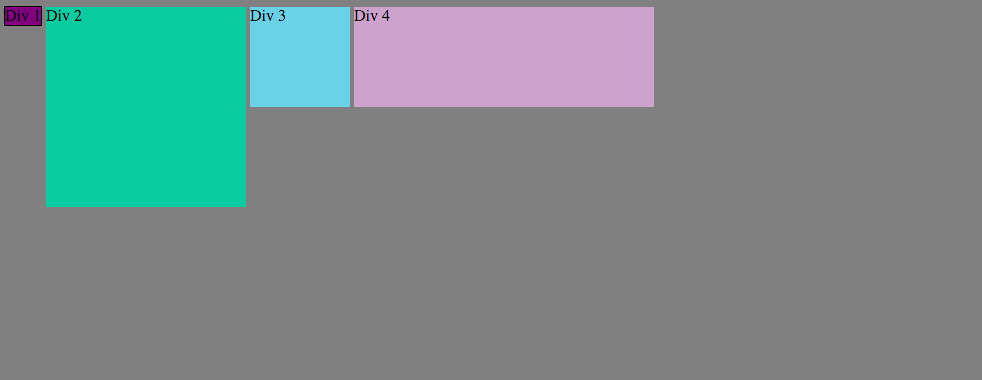
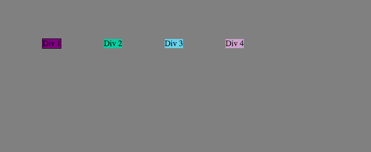
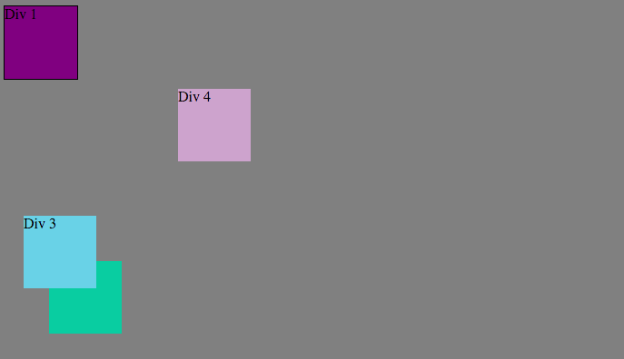
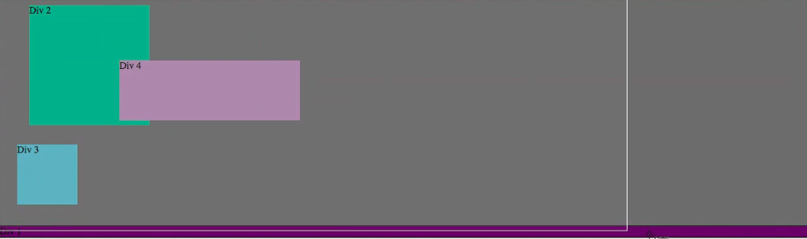
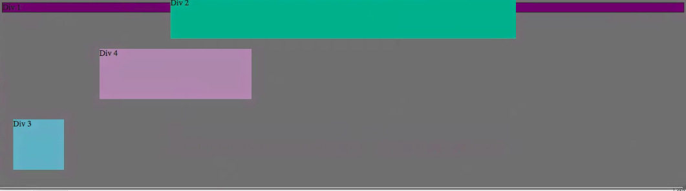
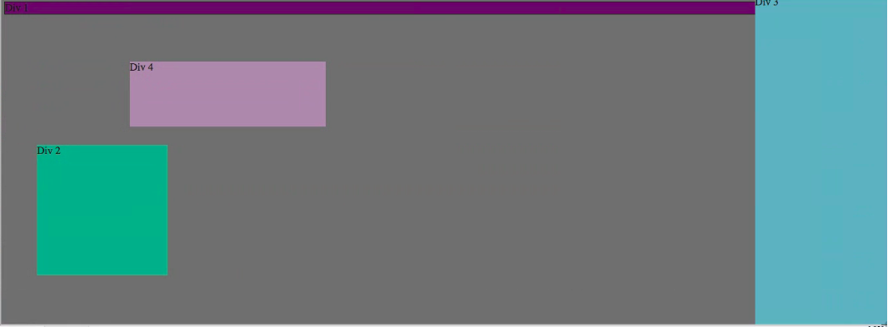
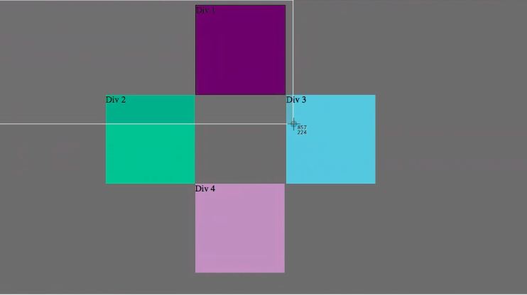

# Positioning Reflection

Exercise 1: 

Exercise 2:

Exercise 3:

Exercise 4:

Exercise 5:

Exercise 6:

Exercise 7:

Exercise 8:

Exercise 9:

*How can you use Chrome's DevTools inspector to help you format or position elements?  
  The Chrome Devtools inspector quickly makes it very clear what css changes make the biggest differences. For example, when you want to check out whether the margins of a certain element are actually moving it, you can just check or uncheck the boxes next to those margins. You will see immediate changes, which is much easier than having to change your css files, save, and then refresh the page each time you make a change. 

*How can you resize elements on the DOM using CSS?  
  You can add css to the elements by changing the height/width attributes. You can use pixels, percentages, or em for this. 

*What are the differences between absolute, fixed, static, and relative positioning? Which did you find easiest to use? Which was most difficult?  
  Static positioning is the standard positioning for any element, which means that there is nothing special about the positioning. Absolute positioning is positioning the element relative to its closest relative in the html tree. So if you have an image within a section, you can move the image in relation to the section. Fixed positioning is setting the element up so that it's in the same place no matter where you've scrolled on the page. Relative positioning is setting up an element in relation to where it would have fallen in its normal position. 

*What are the differences between margin, border, and padding?  
  The padding is the area outside the content but inside the edges of the element itself. So if you have a button, you can increase the padding to allow more space between the button's text and the outside of the element itself. Where the padding ends is the border, which defines the edges of the element. Beyond the border is the margin of the element, which adds space between this element and others. Adding to the margin will move this element away from others. 

*What was your impression of this challenge overall? (love, hate, and why?)  
  I really liked this challenge. I had been working on my website this week already and was going through the process of changing the css, saving, then refreshing the page any time I wanted to check whether something would work. After this revelation of a challenge, I was able to make quicker changes and immediately see the effects before changing them in my css file. 
