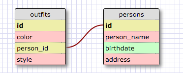

Query 1: SELECT * FROM states; 
Query 2: SELECT * FROM regions;
Query 3: SELECT state_name, population FROM states;
Query 4: SELECT state_name, population FROM states ORDER BY population DESC;
Query 5: SELECT state_name FROM states WHERE region_id=7;
Query 6: SELECT state_name, population_density FROM states WHERE population_density > 50 ORDER BY population_density;
Query 7: SELECT state_name FROM states WHERE population > 1000000 AND population < 1500000;
Query 8: SELECT state_name, region_id FROM states ORDER BY region_id;
Query 9: SELECT region_name FROM regions WHERE region_name LIKE "%central%";
Query 10: SELECT regions.region_name, states.state_name FROM states INNER JOIN regions ON states.region_id=regions.id
   ...> ORDER BY regions.id;  

My Outfit/Person Schema:  
  

## Reflection  
  
* What are databases for?    
	Databases are great at organizing information in a usable format. They make it possible to store, organize, edit, or add information easily. 

* What is a one-to-many relationship?  
  A one to many relationship is when one table (or piece of information) is repeated in another table. In my outfit schema, for example, each outfit would only be owned by one person, but each person could own several outfits. The person ID would be repeated several times in the outfit table. 

* What is a primary key? What is a foreign key? How can you determine which is which?  
	A primary key is a column of data in a table that is unique for each row. It is used to reference it from other tables. If there were duplicates, the related tables wouldn't know which record was being referenced. A foreign key is one that references the primary key of another table. Using my outfit schema again, the person ID has a primary key of ID, and then the person_id column in the outfits table refers to the person. In the schema designer, the primary key is bolded to make it easy to find. Another good hint is to look for which values are unique and not repeated. 

* How can you select information out of a SQL database? What are some general guidelines for that?   
	The general way to see a table is to use the keywords SELECT and FROM. If we wanted to see our entire outfits table for example, we could type "SELECT * FROM outfits". The * symbol tells the terminal that we want to see all columns in whatever table we're looking at (in this case outfits). There is much more you can do with keywords, including filtering (using the WHERE keyword), ordering (using the ORDER BY keyword), and joining different tables (using the JOIN keyword or one of the other join keywords).

